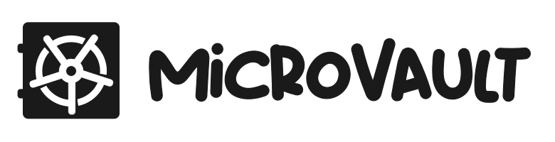

<div align="center">
   <p>
      <a href="https://github.com/kpalatzky/microvault#is=awesome">
      
      </a>
   </p>
   <p>  
      <a href="https://sonarcloud.io/component_measures?metric=Security&id=kpalatzky_microvault">
      
      </a>
            <a href="https://sonarcloud.io/component_measures?metric=Reliability&id=kpalatzky_microvault">
      
      </a>
            <a href="https://sonarcloud.io/component_measures?metric=Maintainability&id=kpalatzky_microvault">
      
      </a>
      <a href="https://sonarcloud.io/project/issues?resolved=false&types=BUG&id=kpalatzky_microvault">
      
      </a>
      <a href="https://sonarcloud.io/project/issues?resolved=false&types=VULNERABILITY&id=kpalatzky_microvault">
      
      </a>
      <br>
      <a href="https://sonarcloud.io/project/issues?resolved=false&types=CODE_SMELL&id=kpalatzky_microvault">
      
      </a>
      <a href="https://sonarcloud.io/component_measures?metric=duplicated_lines_density&id=kpalatzky_microvault">
      
      </a>
   </p>
   <p>
      <a href="https://github.com/kpalatzky/microvault/releases/latest">
      
      </a>    <a href="https://github.com/kpalatzky/microvault/blob/master/LICENSE">
      
      </a>
      <a href="https://app.dependabot.com/">
      
      </a>
   </p>
   <p>
   </p>
   <hr>
   <p>
      Keep your secrets secret. Tool to manage secrets in your public and private repositories. 
      <br>
      <strong>THIS PROJECT IS STILL UNDER DEVELOPMENT - DO NOT USE IT FOR PRODUCTION USE</strong>
   </p>
</div>

## State of development

| Feature            | Done                  |
|--------------------|-----------------------|
| microvault create  | :heavy_check_mark:    |
| microvault get     | :heavy_check_mark:    |
| microvault set     | :heavy_check_mark:    |
| microvault generate| :heavy_check_mark:    |
| microvault list    | :heavy_check_mark:    |
| microvault publish | :x:                   |
| microvault open    | :x:                   |
| microvault close   | :x:                   |

## Get started

### Installation

```shell
# TO BE DEFINED
# curl https://raw.githubusercontent.com/kpalatzky/microvault/master/src/main/resources/scripts/install.sh | sh
```

### Usage

```shell
# create a new vault with given password at the given location
miva --password=password --file=./micro.vault create

# open a session to continues edit the vault. The command substitution is required to set a environment variable
$(miva --password=password --file=./micro.vault open -e) # MICRO_VAULT_SESSION=<SESSION_DATA>

# add data to the vault
miva set db.user Admin
miva generate db.password

miva set docker.user MicroVault
miva set docker.email microvault@example.com
miva set docker.password MicroVault123

# get data from the vault
miva get docker.password

# list content of the vault
miva list

# publish all data as environment variables
$(miva publish environment) # export DOCKER_PASSWORD=<docker.password>

# close the vault again
$(miva close) # MICRO_VAULT_SESSION=

# Use variable as command
MIVA="miva --password=password --file=./micro.vault"
$MIVA get docker.password
$MIVA publish kubernetes --parameter name=my-secrets

# open vault in interative mode
$MIVA open --interative
> get docker.password
> set docker.password Docker123
> exit
```

## Encryption Modes

| Mode       | Encryption                              | Key Length | Public writable    | Public readable    |
|------------|-----------------------------------------|------------|--------------------|--------------------|
| symmetric  | `AES/GCM/NoPadding`                     | 256        | :x:                | :x:                |
| asymmetric | `RSA/ECB/OAEPWITHSHA-256ANDMGF1PADDING` | 4096       | :heavy_check_mark: | :x:                |
| plain      | -                                       |            | :heavy_check_mark: | :heavy_check_mark: |

## Vault file

```json5
{
  "version": "1",
  "encryption": {
    "mode": "asymmetric", // asymmetric | symmetric | plain
    "salt": "<SALT_ENCODED>",
    "readKey": "<READ_KEY_ENCRYPTED>", // for asymmetric decryption
    "writeKey": "<WRITE_KEY_ENCRYPTED>", // for asymmetric encryption
    "key": "<READ_WRITE_KEY_ENCRYPTED>" // for asymmetric decryption/encryption
  },
  "data": {
    "<KEY>": "<ENCRYPTED_VALUE>"
  }
}
```

## Development

### Native Build

```shell
./gradlew build -Dquarkus.package.type=native -Dquarkus.native.container-build=true -Dquarkus.banner.enabled=false -Dquarkus.log.console.enable=false
```

### UberJar / FatJar

```shell
 ./gradlew build  -Dquarkus.package.type=uber-jar -Dquarkus.banner.enabled=false -Dquarkus.log.console.enable=false
```
